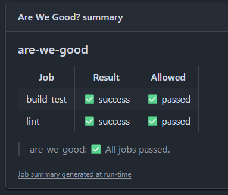
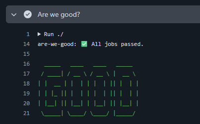

# are-we-good <!-- omit in toc -->

[](https://github.com/lowlydba/are-we-good/actions/workflows/ci.yml)
[](https://opensource.org/licenses/MIT)
[](https://github.com/lowlydba/are-we-good/rules/14655229)
[](https://github.com/lowlydba/sustainable-npm)

Aggregates multiple job and matrix statuses into a single pass/fail status check.

* 🔒 single dependency (Github's `@actions/core` package)
* 📌 immutable releases — tags are locked via [repository rulesets](https://github.com/lowlydba/are-we-good/rules)

## Table of Contents <!-- omit in toc -->

- [Tutorial](#tutorial)
- [How-to Guides](#how-to-guides)
  - [Allow specific jobs to fail or be cancelled](#allow-specific-jobs-to-fail-or-be-cancelled)
  - [Require explicit skip allowlists](#require-explicit-skip-allowlists)
  - [Disable the step summary](#disable-the-step-summary)
  - [Troubleshoot decisions with debug logs](#troubleshoot-decisions-with-debug-logs)
- [Reference](#reference)
  - [Inputs](#inputs)
  - [Outputs](#outputs)
  - [Decision table](#decision-table)
  - [Calling workflow contract](#calling-workflow-contract)
- [Explanation](#explanation)
  - [Why this action exists](#why-this-action-exists)
  - [Output](#output)
    - [Job Summary](#job-summary)
    - [Logs](#logs)

## Tutorial

This quick start shows the smallest complete setup.

1. Add your normal CI jobs.
2. Add a final `are-we-good` job that depends on those jobs.
3. Pass `jobs: ${{ toJSON(needs) }}`.
4. Set `if: always()` so the final job runs even when upstream jobs fail.

```yaml
jobs:
  test:
    strategy:
      matrix:
        node: [22, 24]
    runs-on: ubuntu-slim
    steps:
      - run: npm test

  are-we-good:
    runs-on: ubuntu-slim
    needs: [test]
    if: always()
    steps:
      - uses: lowlydba/are-we-good@375b418aa07a163e0614537a3fa5c51e53a757e9 # v1.0.0
        with:
          jobs: ${{ toJSON(needs) }}
```

Expected result:
- `are-we-good` produces a single pass/fail check you can require in branch protection.
- A markdown step summary is written by default.

## How-to Guides

### Allow specific jobs to fail or be cancelled

Use allowlists when some jobs are advisory.

```yaml
jobs:
  test:
    strategy:
      matrix:
        node: [22, 24]
    runs-on: ubuntu-latest
    steps:
      - run: npm test

  lint:
    runs-on: ubuntu-latest
    steps:
      - run: npm run lint

  are-we-good:
    runs-on: ubuntu-latest
    needs: [test, lint]
    if: always()
    steps:
      - uses: lowlydba/are-we-good@375b418aa07a163e0614537a3fa5c51e53a757e9 # v1.0.0
        with:
          jobs: ${{ toJSON(needs) }}
          allowed-to-fail: lint
          allowed-to-cancel: lint
```

### Require explicit skip allowlists

By default, skipped jobs are accepted for all jobs. To require explicit skip permissions, set `allowed-to-skip` to a non-empty list.

```yaml
with:
  jobs: ${{ toJSON(needs) }}
  allowed-to-skip: docs-only-job
```

### Disable the step summary

```yaml
with:
  jobs: ${{ toJSON(needs) }}
  summary: "false"
```

### Troubleshoot decisions with debug logs

Enable runner debug mode in GitHub Actions to emit per-job decision logs.

- Docs: [Enable debug logging](https://docs.github.com/en/actions/monitoring-and-troubleshooting-workflows/enabling-debug-logging)

## Reference

### Inputs

| Input               | Required | Default  | Description |
|---------------------|----------|----------|-------------|
| jobs                |  yes   | —        | JSON string of job results. Pass ${{ toJSON(needs) }} from the calling workflow. |
| allowed-to-skip     | no       | ""       | Comma-separated list of job names whose skipped result is acceptable. Empty = all jobs may be skipped (wildcard). |
| allowed-to-cancel   | no       | ""       | Comma-separated list of job names whose cancelled result is acceptable. |
| allowed-to-fail     | no       | ""       | Comma-separated list of job names whose failure result is acceptable. |
| summary             | no       | "true"   | Set to "false" to disable the markdown step summary table. |

### Outputs

| Key          | Value                  |
|--------------|------------------------|
| result       | "success" \| "failure" |
| are-we-good  | "true" \| "false"      |

### Decision table

| Result      | Default behavior       | Override input      |
|-------------|------------------------|---------------------|
| success     | ✅ always ok           | n/a                 |
| skipped     | ✅ ok for all jobs     | allowed-to-skip     |
| cancelled   | ❌ fails               | allowed-to-cancel   |
| failure     | ❌ fails               | allowed-to-fail     |

### Calling workflow contract

* Run this action in a final job.
* Use `needs: [job-a, job-b, ...]`.
* Use `if: always()`.
* Pass `jobs: ${{ toJSON(needs) }}`.

## Explanation

### Why this action exists

The usual native approach is a final job with a `run: |` step that checks `${{ contains(needs.*.result, 'failure') }}` and exits 1. That works for the happy path, but it isn't ideal:

* It treats every skipped or cancelled job as a failure unless you manually handle each case with nested conditionals.
* It gives you no visibility: the step produces no output, no per-job breakdown, and no indication of which job caused the failure.
* Once you have matrix jobs, path-filtered jobs, or advisory jobs that are allowed to fail, the if-expression grows into something fragile and hard to review.

are-we-good replaces that pattern with a single action that is easy to read and configure. It handles skipped, cancelled, and failed jobs through explicit allowlists and writes a step summary table with a per-job breakdown. When runner debug mode is on, it emits per-job decision logs so you can trace exactly why a check passed or failed, even if you aren't a GitHub Workflow expert.

It also simplifies branch protection. GitHub requires you to list every required status check by name, and when you run a [matrix build](https://docs.github.com/en/actions/using-jobs/using-a-matrix-for-your-jobs) those names include the matrix values, so the list grows every time a dimension changes. are-we-good reports a single named check regardless of how many jobs feed into it, which means your branch protection configuration stays stable as your matrix evolves.

The same idea applies to monorepos: jobs filtered by changed paths may be skipped on a given PR yet still appear as required checks. Because are-we-good accepts skipped jobs by default, filtered jobs never block a merge.

### Output

#### Job Summary



#### Logs


