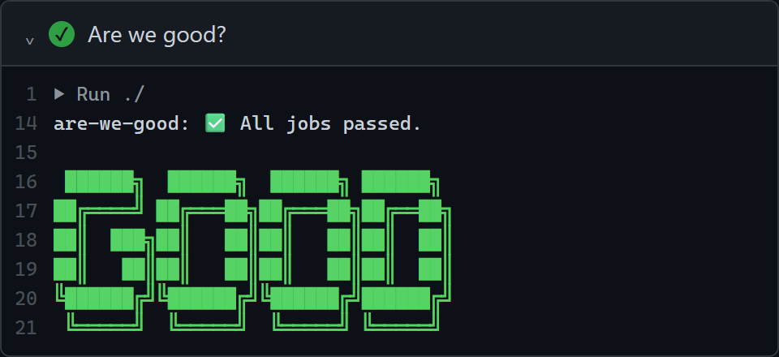

# are-we-good <!-- omit in toc -->

[](https://github.com/lowlydba/are-we-good/actions/workflows/ci.yml)
[](https://opensource.org/licenses/MIT)
[](https://scorecard.dev/viewer/?uri=github.com/lowlydba/are-we-good)
[](https://github.com/lowlydba/are-we-good/rules/14655229)
[](https://github.com/lowlydba/sustainable-npm)

Aggregates multiple job and matrix statuses into a single pass/fail status check.

- 🔒 single dependency (GitHub's `@actions/core` package)
- 📌 immutable releases — tags are locked via [repository rulesets](https://github.com/lowlydba/are-we-good/rules)

## Table of Contents <!-- omit in toc -->

- [Tutorial](#tutorial)
- [How-to Guides](#how-to-guides)
  - [Allow specific jobs to fail or be cancelled](#allow-specific-jobs-to-fail-or-be-cancelled)
  - [Require explicit skip allowlists](#require-explicit-skip-allowlists)
  - [Toggle the step summary and ubuntu-slim notice](#toggle-the-step-summary-and-ubuntu-slim-notice)
  - [Create a uniquely-named check run](#create-a-uniquely-named-check-run)
  - [Troubleshoot decisions with debug logs](#troubleshoot-decisions-with-debug-logs)
- [Reference](#reference)
  - [Inputs](#inputs)
  - [Outputs](#outputs)
  - [Decision table](#decision-table)
- [Explanation](#explanation)
  - [Why this action exists](#why-this-action-exists)
  - [Output](#output)

## Tutorial

The smallest complete setup: add a final job that depends on your CI jobs, runs `if: always()`, and passes `jobs: ${{ toJSON(needs) }}`.

```yaml
jobs:
  test:
    strategy:
      matrix:
        node: [22, 24]
    runs-on: ubuntu-slim
    steps:
      - run: npm test

  are-we-good:
    runs-on: ubuntu-slim
    needs: [test]
    if: always()
    steps:
      - uses: lowlydba/are-we-good@375b418aa07a163e0614537a3fa5c51e53a757e9 # v1.0.0
        with:
          jobs: ${{ toJSON(needs) }}
```

`are-we-good` now produces a single pass/fail check you can require in branch protection, with a markdown step summary written by default.

## How-to Guides

### Allow specific jobs to fail or be cancelled

Use allowlists when some jobs are advisory:

```yaml
with:
  jobs: ${{ toJSON(needs) }}
  allowed-to-fail: lint
  allowed-to-cancel: lint
```

### Require explicit skip allowlists

Skipped jobs are accepted for all jobs by default. Set `allowed-to-skip` to require explicit permission per job instead:

```yaml
with:
  jobs: ${{ toJSON(needs) }}
  allowed-to-skip: docs-only-job
```

### Toggle the step summary and ubuntu-slim notice

By default, are-we-good writes a step summary and — since this is a lightweight, mostly I/O-bound action — recommends [`ubuntu-slim`](https://docs.github.com/en/actions/reference/runners/github-hosted-runners) when it detects a GitHub-hosted `ubuntu-latest` runner (the same motivation as [sustainable-npm](https://github.com/lowlydba/sustainable-npm)). Disable either with `"false"`:

```yaml
with:
  jobs: ${{ toJSON(needs) }}
  summary: "false"
  notify-ubuntu-slim: "false"
```

### Create a uniquely-named check run

The native check for the `are-we-good` job is named after the job itself, so two workflows that both call this action from a same-named job share one required check — satisfied when *either* succeeds, not both. Set `create-check-run: "true"` with a `checks: write` permission to create a per-workflow check instead, named `"<workflow name> / are-we-good"` by default:

```yaml
permissions:
  checks: write

jobs:
  are-we-good:
    runs-on: ubuntu-slim
    needs: [test]
    if: always()
    steps:
      - uses: lowlydba/are-we-good@375b418aa07a163e0614537a3fa5c51e53a757e9 # v1.0.0
        with:
          jobs: ${{ toJSON(needs) }}
          create-check-run: "true"
          github-token: ${{ github.token }}
```

Then require the created check (e.g. `"CI / are-we-good"`) in branch protection instead of the job-level one. Set `check-name` to override the default name.

### Troubleshoot decisions with debug logs

Enable [runner debug logging](https://docs.github.com/en/actions/monitoring-and-troubleshooting-workflows/enabling-debug-logging) to emit per-job decision logs.

## Reference

### Inputs

| Input               | Required | Default | Description                                                                                                       |
| -------------------- | -------- | ------- | ------------------------------------------------------------------------------------------------------------------- |
| `jobs`                | yes      | —       | JSON string of job results. Pass `${{ toJSON(needs) }}` from the calling workflow.                                |
| `allowed-to-skip`     | no       | `""`    | Comma-separated job names whose `skipped` result is acceptable. Empty = all jobs may be skipped (wildcard).       |
| `allowed-to-cancel`   | no       | `""`    | Comma-separated job names whose `cancelled` result is acceptable.                                                 |
| `allowed-to-fail`     | no       | `""`    | Comma-separated job names whose `failure` result is acceptable.                                                   |
| `summary`             | no       | `true`  | Set to `false` to disable the markdown step summary table.                                                        |
| `notify-ubuntu-slim`  | no       | `true`  | Set to `false` to disable the ubuntu-slim runner notice.                                                          |
| `create-check-run`    | no       | `false` | Set to `true` to create a uniquely-named check run via the Checks API. Requires `github-token` and `checks: write`. |
| `check-name`          | no       | `""`    | Overrides the default `"<workflow name> / are-we-good"` name used when `create-check-run` is enabled.             |
| `github-token`        | no       | `""`    | Token used to create the check run when `create-check-run` is enabled, e.g. `${{ github.token }}`.                |

### Outputs

| Key           | Value                  |
| ------------- | ---------------------- |
| `result`      | `"success"` \| `"failure"` |
| `are-we-good` | `"true"` \| `"false"`      |

### Decision table

| Result      | Default behavior     | Override input      |
| ----------- | --------------------- | -------------------- |
| `success`   | ✅ always ok           | n/a                  |
| `skipped`   | ✅ ok for all jobs     | `allowed-to-skip`    |
| `cancelled` | ❌ fails               | `allowed-to-cancel`  |
| `failure`   | ❌ fails               | `allowed-to-fail`    |

## Explanation

### Why this action exists

The usual native approach — a final job with `if: always()` and `${{ contains(needs.*.result, 'failure') }}` — treats every skipped or cancelled job as a failure unless you hand-write a conditional for each one, and it grows fragile once you add matrix jobs, path-filtered jobs, or advisory jobs that are allowed to fail. It also produces no per-job breakdown, so there's no visibility into which job caused the failure.

are-we-good replaces that pattern with one action: allowlists for skipped/cancelled/failed jobs, a step summary table, and per-job debug logs when runner debug mode is on.

It also stabilizes branch protection. GitHub requires listing every required check by name, and [matrix build](https://docs.github.com/en/actions/using-jobs/using-a-matrix-for-your-jobs) job names include the matrix values — so that list grows every time a dimension changes. are-we-good reports one named check regardless of how many jobs feed into it, so branch protection stays stable as the matrix evolves. The same applies to monorepos: path-filtered jobs may be skipped on a given PR yet still be required — since are-we-good accepts skipped jobs by default, filtered jobs never block a merge.

One caveat: that single check is named after the job that runs this action, not the action itself — see [Create a uniquely-named check run](#create-a-uniquely-named-check-run) if multiple workflows share a job name.

### Output

A markdown step summary is written by default:

| Job          | Result     | Allowed   |
| ------------ | ---------- | --------- |
| `build-test` | ✅ success | ✅ passed |
| `lint`       | ✅ success | ✅ passed |

> are-we-good: ✅ All jobs passed.

The final result is also printed to the log:


